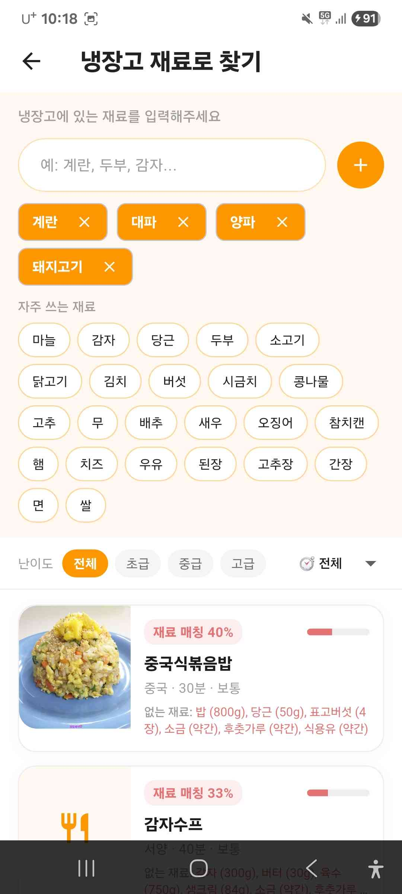
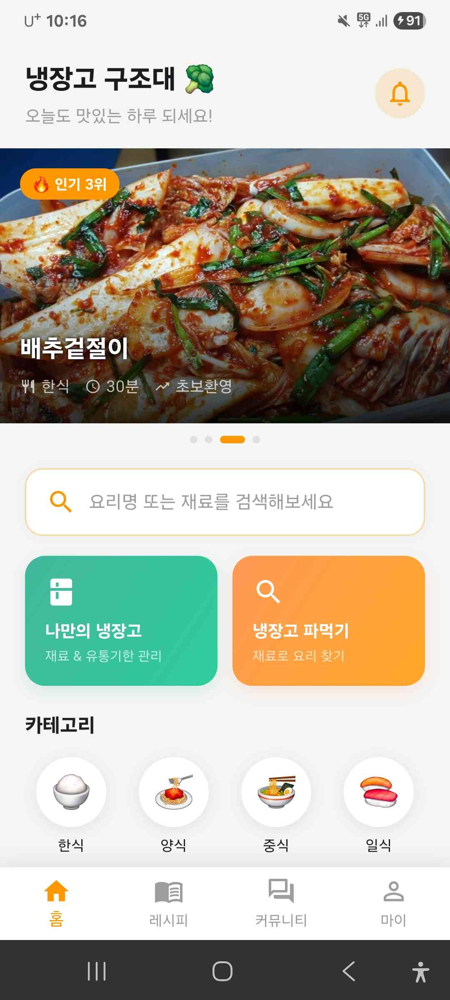
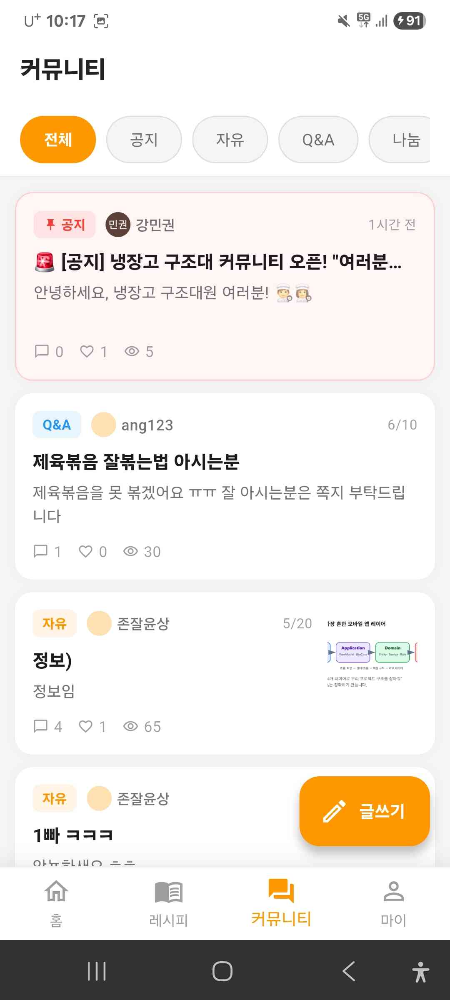
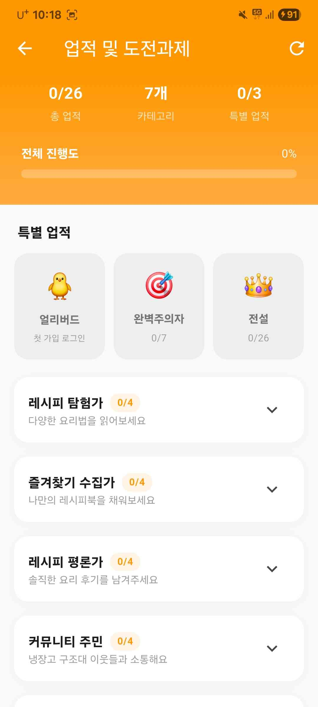

<!-- _paginate: false -->
<!-- _class: title -->
# 🥦 냉장고 구조대

## 남은 재료로 만드는 맛있는 한 끼

Flutter · Firebase · 농림축산식품부 공공 API

**팀원**: 강민권, 김윤상, 김진석, 박성엽 | **2026-06-17**

<!--
[대본]
안녕하세요, 저희 6팀 냉장고 구조대 프로젝트를 발표하겠습니다.
저희 팀은 강민권, 김윤상, 김진석, 박성엽으로 구성되어 있습니다.
저희 어플 냉장고 구조대는 냉장고에 남은 재료로 만들 수 있는 레시피를 추천해주는 소셜 요리 플랫폼입니다.
농림축산식품부 공공 API 기반의 600개 이상 레시피 데이터를 바탕으로,
냉장고 파먹기, 커뮤니티, 업적 시스템까지 갖춘 종합 요리 앱입니다.
-->

---

<!-- _class: overview -->
## 프로젝트 개요

| 항목 | 내용 |
|------|------|
| **앱 이름** | 냉장고 구조대 |
| **플랫폼** | Android / iOS (Flutter 단일 코드베이스) |
| **데이터** | 농림축산식품부 공공 레시피 API — 600+ 레시피 |
| **백엔드** | Firebase (Firestore · Auth · Storage) |
| **인증** | Google · 카카오 · 이메일 3종 + 게스트 모드 |

### 앱 3대 핵심 가치

- 🧊 **냉장고 파먹기** — 보유 재료를 선택하면 만들 수 있는 레시피를 자동으로 매칭
- 💬 **커뮤니티** — 요리 자랑·Q&A·1:1 채팅으로 사용자 간 소통
- 🏆 **업적 시스템** — 26가지 칭호로 꾸준한 앱 사용 동기 제공

<!--
[대본]
저희 앱은 Flutter(플러터) 단일 코드베이스로 Android(안드로이드)와 iOS를 동시에 지원합니다.
핵심 가치는 세 가지인데, 첫 번째는 냉장고 파먹기로 보유 재료를 선택하면 만들 수 있는 레시피를 자동으로 매칭해줍니다.
두 번째는 커뮤니티로 요리 자랑, Q&A, 1:1 채팅으로 사용자 간 소통이 가능하고,
세 번째는 업적 시스템으로 26가지 칭호를 통해 꾸준히 앱을 사용할 동기를 제공합니다.
-->

---

<!-- _class: scr overview -->
## 기획 의도 & 타겟 사용자

### 왜 만들었나?

> 냉장고 속 재료가 애매하게 남아 음식을 낭비한 경험, 누구나 있다.
> 공공 레시피 데이터를 활용해 **재료 기반 레시피 추천**으로
> 이 문제를 해결한다.

### 타겟 사용자

| 타겟 | 핵심 니즈 | 핵심 기능 |
|------|----------|----------|
| **자취생** | 남은 재료로 뭐 해먹지? | 냉장고 파먹기, 유통기한 알림 |
| **요리 초보** | 쉽고 빠른 레시피 | 조리 전용 모드, 난이도 필터 |
| **요리 마니아** | 레시피 공유, 피드백 | 레시피 직접 작성, 커뮤니티 |
| **다이어터** | 칼로리·시간 맞는 레시피 | 조리 시간 필터, 국가별 탐색 |

<div class="img-col"></div>

<!--
[대본]
기획 의도는 간단합니다.
냉장고에 재료가 애매하게 남았을 때 어떻게 활용할지 모르는 문제를 해결하고 싶었습니다.
데이터는 신뢰도가 높고 무료로 제공되는 농림축산식품부 공공 데이터를 기반으로 했습니다.
타겟은 크게 네 그룹이고, 각 그룹의 필요에 맞는 기능을 구현했습니다.
-->

---

<!-- _class: feat -->
## 핵심 기능 요약 & 화면 흐름

| 카테고리 | 구현 기능 |
|----------|----------|
| **레시피** | 600+ 조회·필터·정렬·검색, 직접 작성, 조리 전용 모드 |
| **냉장고** | 재료 등록·유통기한 관리, 재료 기반 레시피 자동 매칭 |
| **개인화** | 북마크, 최근 본 레시피, 좋아요, 활동 내역 |
| **커뮤니티** | 게시글(5카테고리), 댓글·대댓글, 좋아요, 1:1 채팅 |
| **알림** | 댓글·좋아요·유통기한 임박·인기 순위 진입 알림 |
| **업적** | 26가지 칭호, 7개 카테고리 달성도 |
| **관리자** | 대시보드, 레시피·게시글·유저 관리, 공지 게시글 |
| **인증** | Google·카카오·이메일 3종, 게스트 모드 |

<div class="flow-col"><div class="box">🔐 로그인</div><div class="arr">↓</div><div class="box">🧊 냉장고 재료 선택</div><div class="arr">↓</div><div class="box">🍳 레시피 자동 매칭</div><div class="arr">↓</div><div class="box">📋 조리 전용 모드</div><div class="arr">↓</div><div class="box">💬 커뮤니티 공유</div><div class="arr">↓</div><div class="box">🏆 업적 달성</div></div>

<!--
[대본]
구현한 기능을 카테고리별로 정리했습니다.
레시피, 냉장고, 커뮤니티가 핵심 세 축이고, 알림과 업적 시스템이 사용자가 앱을 꾸준히 쓰도록 유도합니다.
그리고 관리자 패널을 통해 콘텐츠와 사용자를 관리할 수 있습니다.

오른쪽은 실제 사용 흐름인데, 로그인 후 냉장고에 재료를 선택하면 레시피가 자동으로 매칭되고, 조리 전용 모드로 요리한 뒤 커뮤니티에 공유하면 업적이 달성되는 흐름입니다.
-->

---

## 기술 선택 근거

| 항목 | 선택 | 주요 대안 탈락 이유 |
|------|------|-------------------|
| **프레임워크** | Flutter | React Native — 성숙도 낮음 / 네이티브 단독 — Android·iOS 별도 개발 필요 |
| **백엔드** | Firebase | 자체 서버 — 개발·운영 비용 과다, WebSocket 별도 구축 필요 / Supabase — Flutter SDK 성숙도 낮음 |
| **상태 관리** | StatefulWidget + StreamBuilder | Riverpod·Bloc — 전역 상태가 AuthService 하나뿐, 도입 대비 효과 낮음 |

### 핵심 결정 근거

> **Flutter** — 단일 코드베이스로 Android·iOS 동시 지원, Firebase 공식 패키지 완비
> **Firebase** — Firestore `snapshots()`가 `StreamBuilder`와 자연스럽게 연동, 서버리스로 개발 기간 내 완성
> **StatefulWidget** — Firestore 스트림 직접 소비, 전역 상태는 `AuthService` 싱글톤 하나로 충분

<!--
[대본]
기술 선택 근거를 한 장으로 정리했습니다.

프레임워크는 Flutter(플러터)를 선택했습니다.
Android(안드로이드)와 iOS를 코드 하나로 지원해야 했는데,
React Native(리액트 네이티브)는 성숙도가 부족하고, 플랫폼별 개발은 인력이 너무 많이 필요해서 Flutter(플러터)가 가장 적합했습니다.

백엔드는 Firebase(파이어베이스)를 선택했습니다.
Firestore(파이어스토어)의 실시간 스트림이 Flutter(플러터) 스트림빌더와 자연스럽게 맞고,
별도 서버 없이 인증, DB, 스토리지를 모두 처리할 수 있어서 개발 기간 안에 완성이 가능했습니다.

상태 관리는 별도 라이브러리 없이 스테이트풀위젯과 스트림빌더를 사용했습니다.
앱 전체에서 공유해야 하는 전역 상태가 로그인 정보 하나뿐이라서 Riverpod(리버팟)이나 Bloc(블록) 같은 복잡한 라이브러리가 필요하지 않았습니다.
-->

---

<!-- _class: arch -->
## 앱 구조 (아키텍처)


<!--
[대본]
앱 구조는 IndexedStack(인덱스드스택) 기반의 4탭 바텀 내비게이션입니다.
홈, 레시피, 커뮤니티, 마이페이지 4개의 메인 탭 아래에 각각 서브 화면들이 연결되는 구조입니다.
레시피 탭에서는 상세보기, 작성, 조리 전용 모드, 북마크, 최근 본 레시피로 이동할 수 있고,
커뮤니티 탭에서는 게시글 상세, 작성, 1:1 채팅, 사용자 프로필 화면으로 이동할 수 있습니다.
로그인하면 알림 감시 서비스가 바로 백그라운드에서 시작되어서,
새 댓글이나 유통기한이 임박한 재료를 감지하면 알림을 생성합니다.
-->

---

## 프로젝트 파일 구조

```
lib/
├── main.dart                  ← 앱 진입점, MainShell (4탭 바텀 내비게이션)
├── admin_config.dart          ← 관리자 이메일 · API 키 상수
├── firebase_options.dart      ← Firebase 플랫폼별 설정 (자동 생성)
├── constants/
│   └── ingredients.dart       ← 냉장고 빠른 선택용 공통 재료 28종
├── screens/                   ← 화면 파일 29개
│   ├── home_screen.dart
│   ├── recipe_list_screen.dart
│   ├── community_screen.dart
│   ├── my_page_screen.dart
│   └── ...
├── services/
│   ├── auth_service.dart      ← 인증 상태 전역 관리 (ChangeNotifier)
│   └── comment_watcher.dart   ← 알림 감시 백그라운드 서비스
└── widgets/
    ├── recommend_card.dart    ← 추천 레시피 카드
    └── trending_card.dart     ← 트렌딩 카드
```

<!--
[대본]
파일 구조입니다.
lib 폴더 아래 screens, services, widgets, constants 네 폴더로 나뉘어 있습니다.
screens 폴더에는 총 29개의 화면 파일이 있습니다.
services 폴더의 auth_service는 로그인 상태를 관리하고, comment_watcher가 알림 감시를 담당합니다.
widgets 폴더에는 여러 화면에서 함께 쓰는 카드 위젯들이 들어 있습니다.
-->

---

<!-- _class: arch -->
## 데이터 흐름


> 클라이언트에서 공공 API를 직접 호출하지 않는 이유:
> 페이지네이션 처리 중 데이터 누락 발생 → 관리자 스크립트로 일괄 동기화

<!--
[대본]
데이터 흐름은 크게 두 단계입니다.

먼저 관리자가 레시피 동기화 스크립트를 실행해서 농림축산식품부 API 데이터를 Firestore(파이어스토어)에 저장합니다.
앱에서 직접 API를 호출하지 않는 이유는, CORS(브라우저 보안 정책) 문제와 페이지네이션 처리 중 데이터가 누락되는 문제가 있었기 때문입니다.

그다음으로 Flutter(플러터) 앱은 Firestore(파이어스토어)를 스트림빌더로 실시간 구독합니다.
채팅, 알림, 레시피 목록 모두 이 방식으로 실시간으로 반영됩니다.
-->

---

## Firestore 컬렉션 구조

```
Firestore
├── recipes/                   — 레시피 (공공 API + 사용자 작성)
│   └── {recipeId}/
│       └── comments/          — 댓글
│           └── {commentId}/
│               └── replies/   — 대댓글
│
├── users/                     — 사용자 정보
│   └── {userId}/
│       ├── bookmarks/         — 북마크
│       ├── recentRecipes/     — 최근 본 레시피
│       ├── likes/             — 좋아요
│       ├── fridge/            — 냉장고 재료
│       ├── notifications/     — 알림
│       └── communityLikes/    — 커뮤니티 좋아요
│
├── community/                 — 커뮤니티 게시글
│   └── {postId}/
│       └── comments/
│
└── chatRooms/                 — 1:1 채팅방
    └── {roomId}/
        └── messages/
```

<!--
[대본]
Firestore(파이어스토어) 컬렉션 구조입니다.
크게 레시피, 사용자, 커뮤니티, 채팅방 네 컬렉션으로 구성되어 있습니다.
각 컬렉션 아래에 서브컬렉션으로 댓글, 대댓글, 북마크, 알림 등이 계층적으로 연결됩니다.
채팅방 ID는 두 사용자 ID와 컨텍스트 ID를 조합해서 생성되기 때문에 중복이 방지됩니다.
-->

---

<!-- _class: scr -->
## 주요 화면 — 홈 & 레시피

### HomeScreen

| 섹션 | 내용 |
|------|------|
| 자동 회전 배너 | 누적 조회수 TOP 4 레시피 (4초 간격) |
| 냉장고 배너 | 냉장고 관리·냉장고 파먹기 빠른 진입 |
| 카테고리 그리드 | 국가별 7종 (한식·서양·중국·일본·동남아·이탈리아·퓨전) |
| 🔥 트렌딩 | 좋아요×3 + 조회수 합산 기준 TOP 6 |
| ⭐ 오늘의 추천 | 오늘 조회수 TOP 3 (피처드 카드) |
| ⚡ 초간단 레시피 | 조리 시간 25분 이하 TOP 6 |

### RecipeDetailScreen 특징

- 단계별 조리 순서 + 단계별 이미지 지원
- 별점 평균, 익명·닉네임 전환 토글, 댓글 좋아요

<div class="img-col"></div>

<!--
[대본]
홈 화면은 자동 회전 배너, 냉장고 배너, 카테고리 그리드 등 여러 섹션으로 구성되어 있습니다.
트렌딩 레시피 기준은 좋아요에 3배 가중치를 두고 조회수를 합산하는 방식입니다.
반응형 레이아웃을 적용해서 화면 너비에 따라 카드 격자 또는 가로 스크롤로 자동 전환됩니다.
레시피 상세 화면은 넓은 화면에서 레시피 정보와 댓글을 2컬럼으로 나란히 배치합니다.
-->

---

<!-- _class: scr -->
## 주요 화면 — 냉장고 & 커뮤니티

### FridgeScreen + IngredientSearchScreen

```
[냉장고 관리]                      [냉장고 파먹기]
자주 쓰는 재료 칩 빠른 선택    →   보유 재료 선택
재료명 · 수량 · 유통기한 입력  →   난이도 · 조리 시간 필터
D-3 이하 → 알림 자동 발송     →   매칭 레시피 자동 표시
```

### CommunityScreen

| 카테고리 | 작성 권한 |
|----------|----------|
| 공지 | 관리자 전용 |
| 자유 / Q&A / 나눔 | 모든 사용자 |

- 게시글·댓글 좋아요, 조회수 자동 증가
- 게시글 작성자 → `UserProfileScreen` → **채팅 시작** 버튼
- 채팅방 ID: `{user1_id}_{user2_id}_{contextId}` 형태로 중복 방지

<div class="img-col"></div>

<!--
[대본]
냉장고 파먹기는 보유 재료를 선택하면 그 재료를 포함하는 레시피를 앱 안에서 자동으로 매칭해줍니다.
유통기한이 3일 이하로 남은 재료는 알림이 자동으로 발송됩니다.

커뮤니티는 공지, 자유, Q&A, 나눔 카테고리로 구성되어 있고, 공지는 관리자만 작성할 수 있습니다.
게시글에서 작성자 프로필을 탭하면 바로 1:1 채팅을 시작할 수 있습니다.
-->

---

<!-- _class: scr sm -->
## 주요 화면 — 업적 & 알림

### 업적 · 칭호 시스템

| 카테고리 | 칭호 예시 | 조건 |
|----------|-----------|------|
| 레시피 탐험가 | 식탐러 → 전설의 미식가 | 레시피 조회 10~300회 |
| 즐겨찾기 수집가 | 메모장 → 레시피 도서관 | 북마크 5~100개 |
| 레시피 평론가 | 맛 초보 → 식신 | 댓글 3~50개 |
| 커뮤니티 주민 | 새내기 → 터줏대감 | 게시글 1~30개 |
| 냉장고 파먹기 | 냉장고 청소부 → 재료 연금술사 | 냉장고 검색 5~50회 |

**특별 업적**: 얼리버드 · 완벽주의자 · 전설 (26가지 모두 달성)

### 알림 시스템

| 알림 타입 | 발생 조건 |
|-----------|----------|
| 레시피 댓글 | 내 레시피에 새 댓글 |
| 커뮤니티 댓글 | 내 게시글에 새 댓글 |
| 인기 순위 진입 | 내 레시피가 오늘 TOP 10 (하루 1회) |
| 유통기한 임박 | 냉장고 재료 D-3 이하 |

<div class="img-col"></div>

<!--
[대본]
업적 시스템은 총 26가지 칭호로 구성되어 있고, 7개 카테고리별로 달성도를 보여줍니다.
획득한 칭호 중 하나를 대표 칭호로 선택해서 프로필에 표시할 수 있습니다.

알림은 로그인하면 알림 감시 서비스가 백그라운드에서 Firestore(파이어스토어)를 감시하면서 발송합니다.
유통기한 알림은 하루 1회만 체크해서 불필요한 중복 알림을 막았습니다.
-->

---

<!-- _class: sm -->
## 개발 이력

| 단계 | 주요 작업 | 상태 |
|------|----------|------|
| **Phase 1** | Firebase 연동, 기본 화면 구성 (홈·레시피·마이페이지) | ✅ 완료 |
| **Phase 2** | 레시피 필터·정렬·검색, 북마크·최근 본 레시피 | ✅ 완료 |
| **Phase 3** | 커뮤니티, 냉장고 파먹기, 업적 시스템 | ✅ 완료 |
| **Phase 4** | 1:1 채팅, 관리자 패널, 운영자 칭호 | ✅ 완료 |
| **Phase 5** | 알림 실제 동작 연동, 알림 설정 ON/OFF | ✅ 완료 |

### ✅ 현재 완성된 기능

- Google · 카카오 · 이메일 3종 인증 + 게스트 모드
- 레시피 600+ 조회·검색·필터·정렬·직접 작성
- 냉장고 재료 관리 + 냉장고 파먹기
- 커뮤니티 게시글·댓글·1:1 채팅
- 알림 (댓글·유통기한·인기 순위 진입)
- 26가지 업적·칭호 시스템
- 관리자 패널
- 크로스플랫폼 (Android·iOS)

<!--
[대본]
개발은 총 5단계로 진행했습니다.
1단계에서 Firebase 연동과 기본 화면을 구성했고, 2단계에서 레시피 필터·검색과 북마크 기능을 추가했습니다.
3단계에서 커뮤니티, 냉장고 파먹기, 업적 시스템을 완성했고, 4단계에서 1:1 채팅과 관리자 패널을 구현했습니다.
마지막 5단계에서 알림 실제 동작 연동과 알림 설정 기능까지 마무리해서 현재 모든 기능이 완성된 상태입니다.
-->

---

## 애로사항 및 해결

| 날짜 | 문제 | 해결 방법 |
|------|------|----------|
| **3/18** | 레시피 카테고리 기능 구현에 필요한 DB가 없고, 데이터를 직접 입력하기엔 양이 너무 많았음 | 농림축산식품부 공공 레시피 API를 발급받아 600개 이상의 레시피 데이터를 자동으로 확보 |
| **3/25** | 팀원 4명이 각자 따로 작업하다 보니 서로 어떤 내용을 개발했는지 파악이 어려웠음 | Git을 도입하여 브랜치별로 작업을 나누고 PR을 통해 코드 변경 내역을 팀 전체가 공유 |
| **4/1** | 공공 API 점검 중 일부 레시피에 이미지가 없는 것을 발견 | AI를 활용해 해당 재료 이미지를 생성하여 업로드하는 방식으로 변경 |
| **4/15** | 레시피 작성 시 사진 업로드 기능에 오류 발생 | Firebase Storage를 도입하여 이미지 업로드 기능 재구현 |

<!--
[대본]
개발하면서 겪었던 주요 애로사항입니다.

3월 18일에는 레시피 카테고리 기능을 구현하려고 보니 데이터가 전혀 없어서, 농림축산식품부 공공 레시피 API를 발급받아 600개 이상의 데이터를 한 번에 확보했습니다.

3월 25일에는 팀원 4명이 각자 따로 작업하다 보니 서로 무엇을 개발하고 있는지 파악이 어려웠는데, Git을 도입해서 브랜치별로 작업을 나누고 PR을 통해 변경 내역을 공유하는 방식으로 해결했습니다.

4월 1일에는 공공 API 데이터를 점검하다 보니 일부 레시피에 이미지가 없다는 걸 발견하고, AI를 활용해서 해당 재료와 비슷한 이미지를 생성해 업로드하는 방식으로 해결했습니다.

4월 15일에는 레시피 작성 화면에서 사진 업로드 기능에 오류가 생겨서, Firebase Storage(파이어베이스 스토리지)를 도입해 이미지 업로드 기능을 새로 구현했습니다.
-->

---

<!-- _paginate: false -->
<!-- _footer: "설계 결정의 모든 근거는 docs/decisions/ ADR 3건에 기록되어 있습니다." -->
# 감사합니다 🥦

<!--
[대본]
네 이것으로 6팀 발표를 마치겠습니다. 감사합니다.
-->
